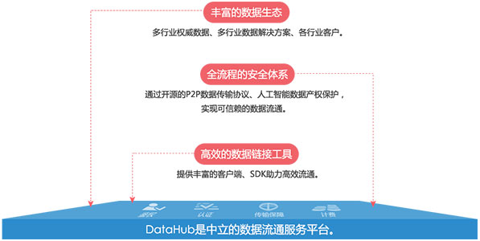

DataHub 是数据链接平台，是数据链接的工具。

DataHub 是北京亚信数据有限公司的战略定位，旨在凭借多年在大数据方面的技术积累、为各行业客户提供解决方案的经验，为各行各业的客户提供便利的数据流通通道，将 DataHub 打造为公正的第三方数据链接平台，面向全社会链接数据需求方、数据拥有者、独立数据分析方、其它数据平台，打造数据流通产业链。

# 关于北京亚信数据有限公司

北京亚信数据有限公司是隶属于亚信集团的分公司之一。凭借自身雄厚的大数据加工和处理的技术优势，以数据资产为核心，以“数据、能力、资本”为纽带，聚合数据资产，领航产业升级，创建产业生态。

LDP 云平台负责搭建和运营 DataHub （数据生态链接平台）以及利用产品线提供的产品负责搭建和运营亚信大数据公有云平台，并协助各行业线提供公有云的交付模式。 LDP 平台将大数据和云计算有效的结合，实现数据网络效应，并且与其他其他行业线产品线一起打造实现 LDP 战略和平台。