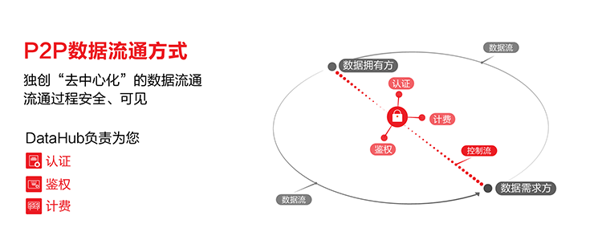
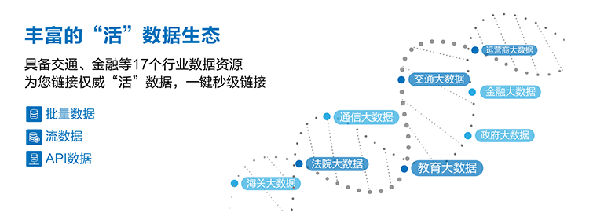
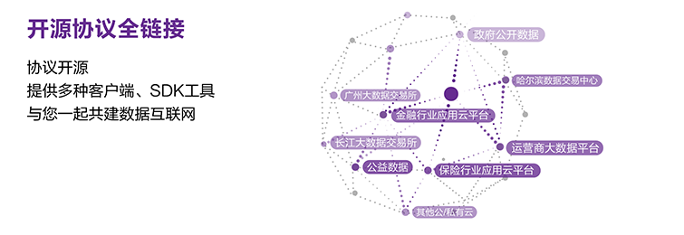

------------------------------------------------------------------------------------------------------------------------------------------------------------
- DataHub 是数据链接平台，是数据链接的工具。

- DataHub 是一个中立的数据流通服务平台，旨在通过提供开源的数据流通协议，为各行各业的客户提供便利的数据流通通道，将 DataHub 打造为公正的第三方数据链接平台，面向全社会链接数据需求方、数据拥有者、独立数据分析方、其它数据平台，打造数据流通产业链。

------------------------------------------------------------------------------------------------------------------------------------------------------------

------------------------------------------------------------------------------------------------------------------------------------------------------------

------------------------------------------------------------------------------------------------------------------------------------------------------------

------------------------------------------------------------------------------------------------------------------------------------------------------------

## DataHub 术语介绍与解释

| 术语        | 中文            |解释           | 
| :----------| :----------     |:----------  |
| Repository（简称Repo）| 数据集 |一个数据集合，下面能具体数据项|
| Item       |数据项            |一个数据产品，类型可以是批量数据、接口数据、流数据。有数据样例，元数据展示|
| Tag        |数据粒            |数据产品的具体内容，一个数据项 Item 下至少有一个 Tag 、可以有多个 Tag |
