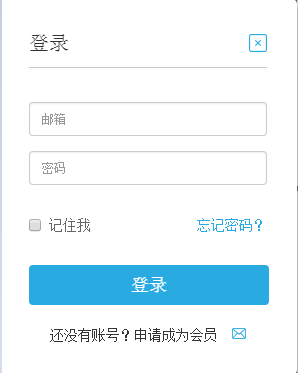
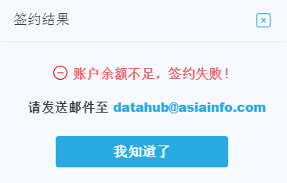
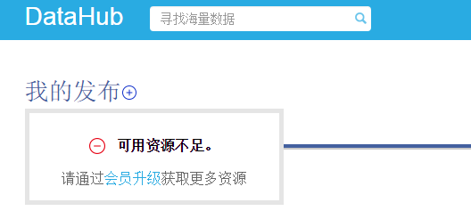
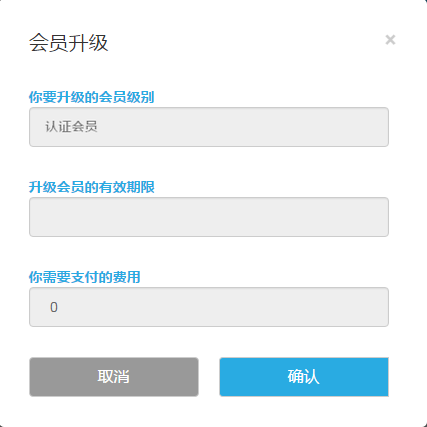
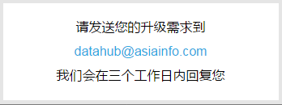

**第一步：用户注册**

**数据需求方：**

- DataHub 平台的会员级别分为四级，分别是：注册用户、认证会员、金卡会员、钻石会员。
- 不同级别的会员拥有不同的会员特权：
 - 注册为 DataHub 用户，可以获取免费数据。
 - 免费升级为认证会员，可以获取付费数据，付费类型为预付费。
 - 付费升级为金卡会员，可以获取更多免费、付费数据，付费类型为预付费。
 - 付费升级为钻石会员，可以获取更多付费数据，付费类型为后付费。

**数据提供方：**

- DataHub 平台的会员级别分为四级，分别是：注册用户、认证会员、金卡会员、钻石会员。
- 不同级别的会员拥有不同的会员特权：
 	- 注册为 DataHub 用户，无发布数据权限。
	- 免费升级为认证会员，可以获得发布开放数据资源量。
	 - 开放数据：所用用户可见；可以邀请他人协作发布数据项。
	- 付费升级为金卡会员，可以获得数据托管空间、发布私有数据等资源量。
	- 付费升级为钻石会员，可以获得更多数据托管空间、发布私有数据等资源量。
	 - 私有数据：指定用户可见。
	 
1）登录网址：[https://hub.dataos.io](https://hub.dataos.io)

2）点击“登录”、“申请注册”，发送邮件到datahub@asiainfo.com即可完成申请（已有 DataHub 账号可直接登录）。

**第二步：会员认证**

1）用户注册 DataHub 账号后就可购买及下载免费数据了。

- 数据需求方：
如果数据是需付费购买的，那么在点击“立刻订购”时会提示“账户余额不足，签约失败！”，需前往“会员升级”页面进行认证，并发送充值需求至 datahub@asiainfo.com。

- 数据需求方：
如果需要通过 DataHub 平台发布数据，您的用户级别需为认证会员及以上。否则在“我的发布”中点击“+”发布数据时会提示“可用资源不足，请通过会员升级获取更多资源”

2）进入“会员升级”，点击“认证会员”下方的“马上升级”，确认升级的会员级别为“认证会员”。

（3）根据提示发送您的升级需求到 datahub@asiainfo.com，我们会在三个工作日内回复您。

 
（4）审核通过后，您会收到邮件和站内消息通知，代表您已成为了 DataHub 平台的认证会员，可以购买付费数据了。

**第三步：可查看认证信息**
对于已经认证通过的用户，可在 DataHub 平台的“个人中心”-“基本信息”页面中查看自己的认证状态和资源状态。

